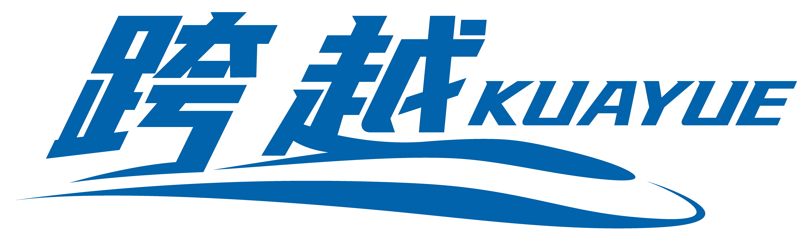

<!---
WIP, When the mod is released, please uncomment the following lines

-->

其他语言 | Other languages : <a href="README.en.md">English</a>

## Introduction

KuaYue is a CR-Style Railway add-ons for Create.

As both a decorative and functional mod, KuaYue adds the locomotive, carriages, and ground equipment which currently in use or retired by CR to the Create's Railway system. And we plan to implement features like driving and scheduling based on CR specifications.

## Snapshot

## Roadmap

## 开发组

## Acknowledgment
